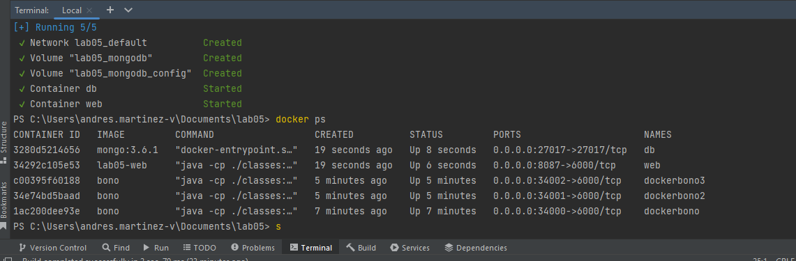
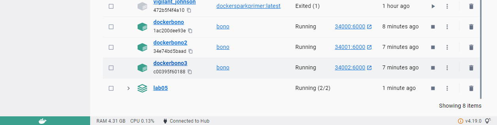
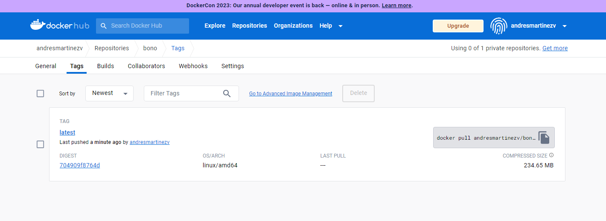

 # AREP-BONO

 A contonuacion mostrare la creacion de un docker para la virtualizacion
 


En esta imagen podemos evidenciar el funcionamiento de las maquinas ya creadas con el bono dentro del docker



El docker de escritorio con todo activo



Y la ultima muestra el docker hub con la virtualizacion completada 

Para correr el contenedor tenemos que ejecutar el siguiente comando:
```
docker run -d -p 4567:4567 --name bono andresmartinezv/bono
```
Podremos entrar al cliente web entrando en la url [localhost:34001/index](localhost:34001/index)
